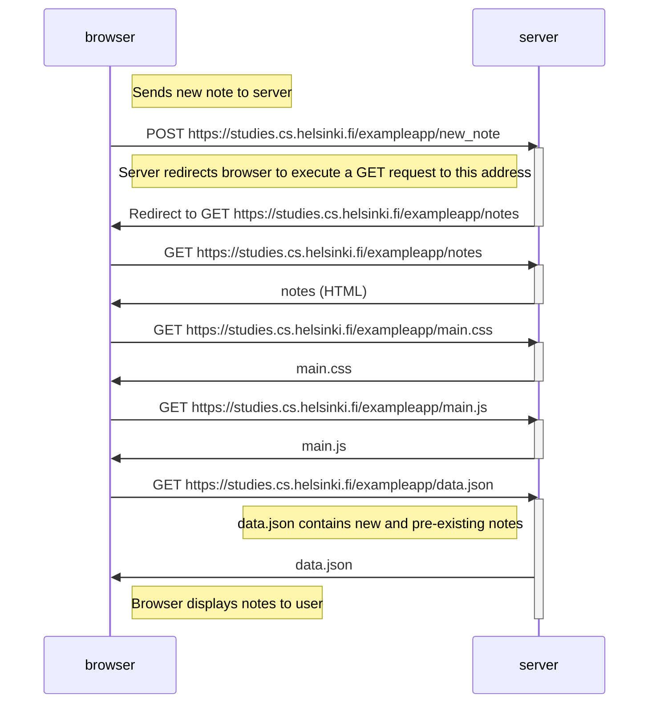

```mermaid
sequenceDiagram
    participant browser
    participant server

    Note right of browser: Sends new note to server
    browser ->> server: POST https://studies.cs.helsinki.fi/exampleapp/new_note
    activate server
    Note left of server: Server redirects browser to execute a GET request to this address
    server ->> browser: Redirect to GET https://studies.cs.helsinki.fi/exampleapp/notes
    deactivate server

    

    browser ->> server: GET https://studies.cs.helsinki.fi/exampleapp/notes
    activate server
    server ->> browser: notes (HTML)
    deactivate server

    browser ->> server: GET https://studies.cs.helsinki.fi/exampleapp/main.css
    activate server
    server ->> browser: main.css
    deactivate server

    browser ->> server: GET https://studies.cs.helsinki.fi/exampleapp/main.js
    activate server
    server ->> browser: main.js
    deactivate server

    browser ->> server: GET https://studies.cs.helsinki.fi/exampleapp/data.json
    activate server
    Note left of server: data.json contains new and pre-existing notes
    server ->> browser: data.json
    Note right of browser: Browser displays notes to user
    deactivate server
```
